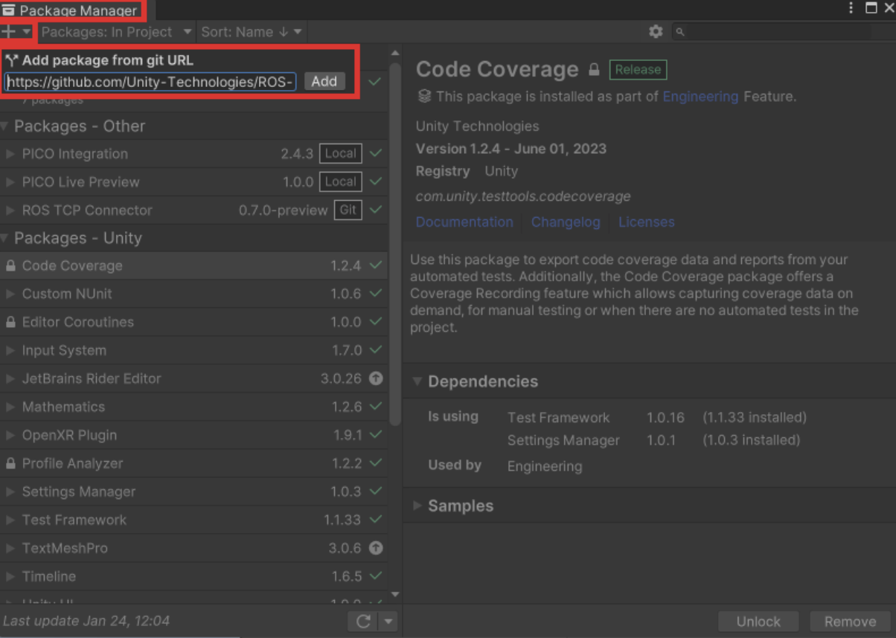
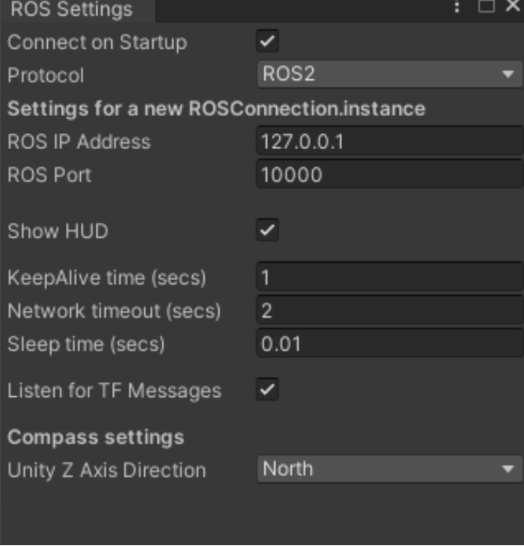

# CoHoMa Unity

Projet Unity client à héberger sur un casque de réalité virtuelle Pico 4. Permet de communiquer avec un serveur ROS afin d'échanger des informations avec des drones.

## Installation

> Être à la racine de ce dossier pour exécuter toutes les commandes

### Prérequis

- Système d'exploitation baasé sur Debian

### Installation de Unity Hub

Unity Hub est un outil qui permet de gérer les différentes versions de Unity et les différents projets installés sur votre machine. Il est recommandé de l'installer pour faciliter la gestion des projets Unity.

Pour cela, ajoutez les droits en exécutant la commande suivante:

```bash
chmod +x install_unity_hub.sh
```

Puis, exécuter le script suivant dans votre terminal:

```bash
./install_unity_hub.sh
```

Ensuite, ouvrez Unity Hub et veuillez créer un compte Unity.

### Installation de l'éditeur Unity

L'éditeur Unity est l'outil de développement pour les projets Unity. C'est ce logiciel qui permet de créer, modifier et compiler les projets Unity.

Le projet CoHoMa Unity a été développé avec la version 2021.3.33f1 de Unity. Il est recommandé d'installer cette version pour éviter tout problème de compatibilité.

Pour cela, ajoutez les droits en exécutant la commande suivante:

```bash
chmod +x install_unity_editor.sh
```

Puis, exécuter le script suivant dans votre terminal:

```bash
./install_unity_editor.sh
```

Ensuite, veuillez suivre l'assistant de téléchargement de Unity en acceptant les conditions d'utilisation et en choisissant le composant Unity 2021.3.33f1

Enfin, veuillez ajouter une License personnal.

### Installation du projet CoHoMaUnity

Pour installer le projet CoHoMa Unity, il faut créer un nouveau projet Unity et y importer les fichiers du projet CoHoMa Unity.

Pour cela, ajoutez les droits en exécutant la commande suivante:

```bash
chmod +x create_unity_project.sh
```

Puis, exécuter le script suivant dans votre terminal:

```bash
./create_unity_project.sh
```

## Utilisation

### Ouverture du projet CohomaUnity

Ajoutez les droits en exécutant la commande suivante:

```bash
chmod +x open_unity_project.sh
```

Puis, exécuter le script suivant dans votre terminal:

```bash
./open_unity_project.sh
```

### Connexion entre ROS et Unity

### Ajout du package ROS 

Dans l'onglet Window, ouvrir le Package Manager et cliquer sur le bouton + en haut à gauche. Sélectionner Add package from git URL et entrer https://github.com/Unity-Technologies/ROS-TCP-Connector?path=/com.unity.robotics.ros-tcp-connector afin d'installer le package.



### Réglages ROS2 et Docker

Dans l'onglet Robotics/ROS Settings, entrez l'adresse IP de la machine qui lance le conteneur Docker (127.0.0.1 par défaut) et changer le Protocol en ROS2.



### Ajout du package PICO-Unity-Ingegration-SDK 

Dans l'onglet Window, ouvrir le Package Manager et cliquer sur le bouton + en haut à gauche, Sélectionner Add package from git URL et entrer https://github.com/Pico-Developer/PICO-Unity-Integration-SDK afin d'installer le package ( même manipulation que pour le package ROS ).


